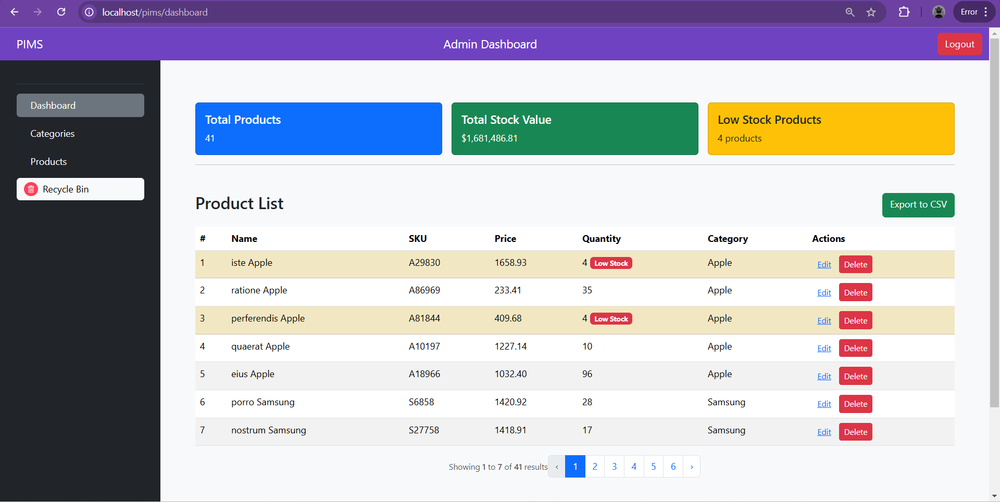

# Product Inventory Management System(PIMS)
 This project builds a Product Inventory Management System using Laravel, PHP, MySQL, and Bootstrap 5. It includes authentication, CRUD operations for products, category management, stock management with low stock alerts, and form validation. Optional features: dashboard, soft deletes, and CSV export.

 ## Screenshot

 
