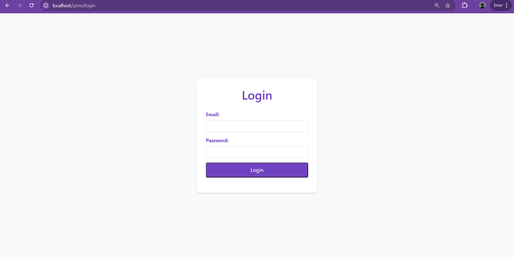

# Product Inventory Management System(PIMS)
 This project builds a Product Inventory Management System using Laravel, PHP, MySQL, and Bootstrap 5. It includes authentication, CRUD operations for products, category management, stock management with low stock alerts, and form validation. Optional features: dashboard, soft deletes, and CSV export.

#Project Setup
To set up the project after downloading, simply run two commands. First, use "php artisan migrate" to create all the necessary database tables, including default Laravel tables and custom ones like categories and products. Next, execute "php artisan db:seed "to populate the database with initial data, such as sample categories, products, and user credentials. This will prepare the project with all required data and structure for use.

 #Dashboard

If a product’s stock quantity drops below 5, the system displays a warning message.
This feature helps users take timely actions, such as reordering or replenishing stock, to avoid running out of critical products.

#login

default 
email : admin@mail.com
password : 123

 
